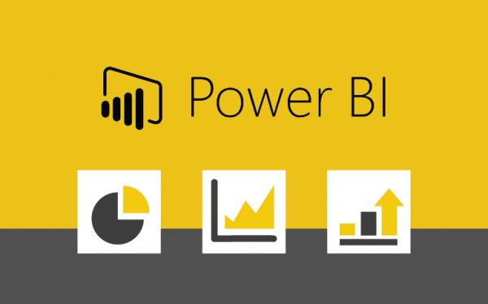
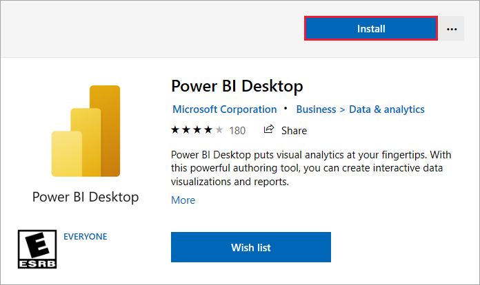
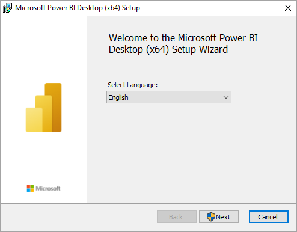
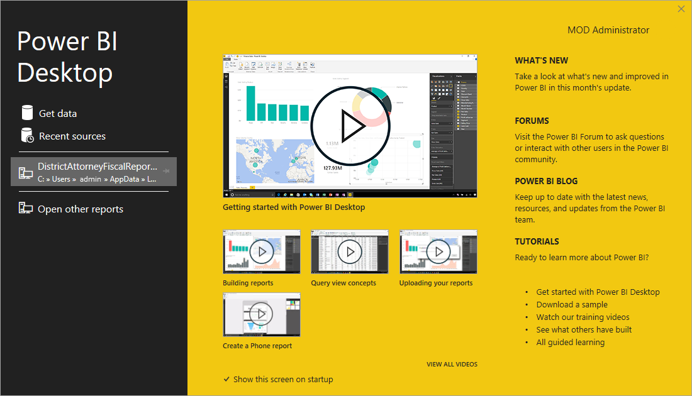

<h1 align="center"> Getting Started with PowerBI </h1>

  
 

<be>

  

  
## Overview
This repository provides a comprehensive guide on how to install Power BI Desktop on your computer. Power BI is a powerful business analytics tool by Microsoft that enables users to create interactive visualizations and business intelligence reports.

## Prerequisites
- Windows 7 / Windows Server 2008 R2, or later
- .NET 4.5 or later
- At least 2 GB of RAM (4 GB recommended)
- At least 1 GB of available disk space, x64 processor

## Installation Steps

### 1. Download Power BI Desktop
1. Go to the [Power BI website](https://powerbi.microsoft.com/en-us/desktop/).

2. Click on the **"Download Free"** button.
3. You will be redirected to the Microsoft Store. 

Click on the **"Install"** button to start the download.

### 2. Install Power BI Desktop
1. Once the download is complete, open the installer file.
2. Follow the on-screen instructions to complete the installation.

### 3. Launch Power BI Desktop
1. After the installation is complete, launch Power BI Desktop from the Start menu or desktop shortcut.
2. You may be prompted to sign in with your Microsoft account.

### 4. First Time Setup
1. When you launch Power BI Desktop for the first time, you will see the welcome screen. Click on **"Get started"**.
   
2. You can start by loading your data and creating your first report.

## Additional Resources
- [Power BI Documentation](https://docs.microsoft.com/en-us/power-bi/)
- [Power BI Community](https://community.powerbi.com/)
- [Power BI Tutorials](https://powerbi.microsoft.com/en-us/learning/)

## Contributing
We welcome contributions from the community! Please read our [contributing guidelines](CONTRIBUTING.md) for more information.

## License
This project is licensed under the MIT License - see the [LICENSE](LICENSE) file for details.

## Acknowledgements
- Thanks to Microsoft for providing Power BI and its excellent documentation.
- Inspired by tutorials and guides from the Power BI community.
